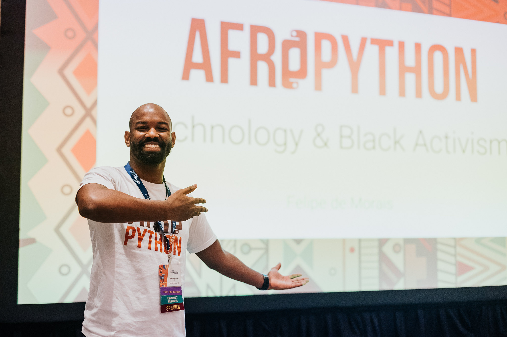
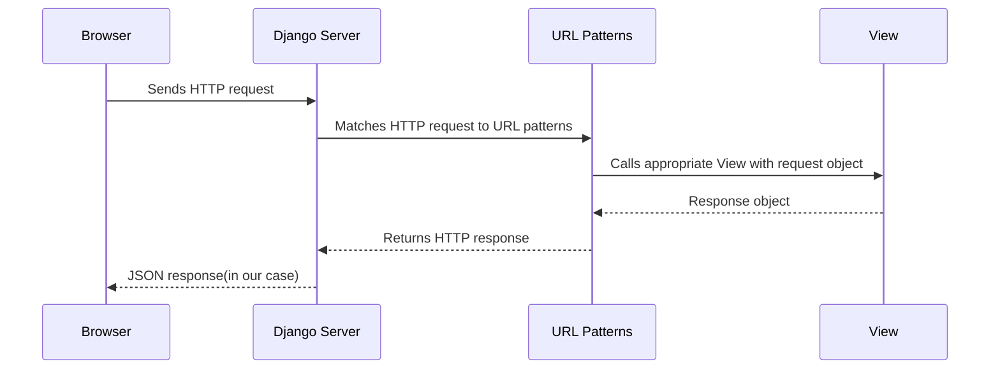
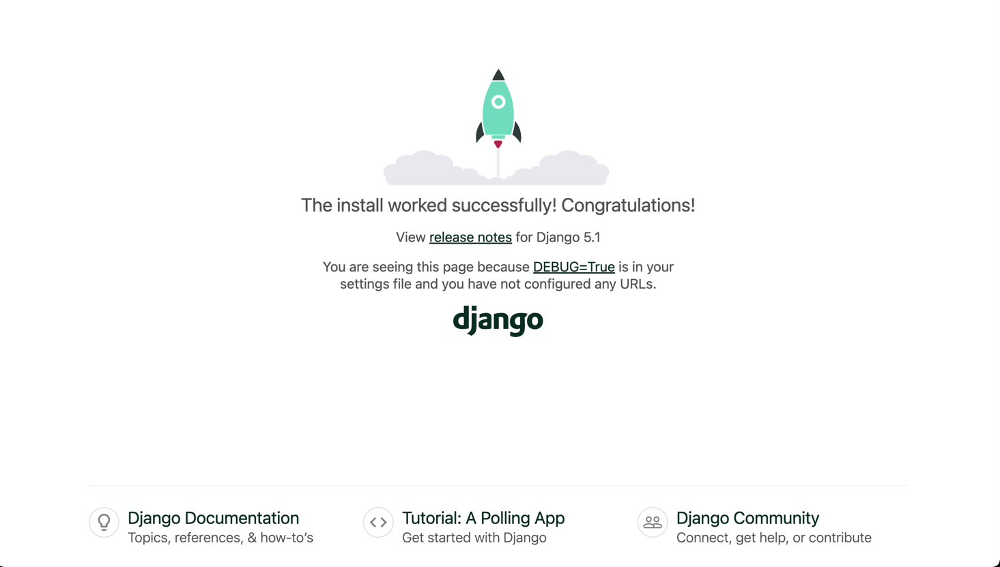

# Tutorial

## Summary

The goal of this tutorial is for you to have Music API ready to receive songs, albums, and artists. While you learn [Django](https://www.djangoproject.com/) and [Django Rest Framework a.k.a DRF](https://www.django-rest-framework.org/) to build you first API

Requirements list:

1. Python 3.12
2. Git
3. [uv](https://docs.astral.sh/uv/)

---
- **Total Duration:** 3 hours 30 minutes
- **Lecture:** 1 hour (approximately 30%)
- **Exercises:** 2 hours 30 minutes (approximately 70%)

## Who am I?

Hey! I'm FeliPython a.k.a.
Felipe de Morais.
👋🏾 I'm a seasoned software engineer with extensive experience in Python, Django development, and now FastAPI.
🐍


When I'm not coding, you'll find me rolling on the mats as a [Brazilian] Jiu Jitsu Blue Belt, embracing the discipline and challenges of the sport. Because life needs a furry friend, I train my dog solo, which has been an incredibly rewarding experience. 🐕


[Presentation slides](https://docs.google.com/presentation/d/1xE8d5XkeKC9hHBVGwbgvjbFEqcCzP9Hy7Qxb8EGjm7A/edit?usp=sharing) 📊


## Introduction and Overview

### [Django](https://www.djangoproject.com/)
To start, we first need to understand what Django is. Django is the most popular web framework in the Python ecosystem, characterized by its high-level structure that encourages rapid development and clean, pragmatic design. It has been constructed by experienced developers and aims to mitigate the hassles of web development; this allows developers to focus their attention on writing their app without feeling the need to reinvent the wheel. Django is a free and open-source framework that is ingrained in the model-template-views architectural pattern. Its maintenance is overseen by the [Django Software Foundation](https://www.djangoproject.com/foundation/), an independent, non-profit organization based in the United States.

### [Django Rest Framework](https://www.django-rest-framework.org/)
The Django Rest Framework is a powerful library constructed on top of Django, with a unique interlinking to the Django Model. This relationship endows Django with the enhanced ability to create APIs(application programming interfaces).

An important thing to know about Django is how the information usually flows



The sequence diagram illustrates the flow of an HTTP request through the Django web framework. Let's break it down step by step:

1. **Browser Sends HTTP Request:** The process begins when the user interacts with the browser, triggering an HTTP request. This request is sent to the Django server.

2. **Django Server Receives Request:** Upon receiving the request, the Django server forwards it to the URL dispatcher (URL Patterns) to determine which view function should handle it.

3. **URL Patterns Match Request to View:** The URL dispatcher matches the incoming HTTP request to the appropriate view function based on the URL patterns defined in the Django project. It then calls the corresponding view function, passing along the request object.

4. **View Processes Request:** The view function performs the necessary processing based on the request received. This could involve querying the database, performing business logic, or any other required tasks. Once the processing is complete, the view returns a response object.

5. **Response Travels Back:** The response object generated by the view function travels back through the same path it came from, starting with the URL dispatcher. The response is passed back to the Django server.

6. **HTTP Response Returned:** The Django server sends the HTTP response, typically in the form of JSON data in your case, back to the browser, fulfilling the original request.

This sequence outlines the typical flow of a request-response cycle in Django, demonstrating how requests are handled and responses are generated within the framework.

## Set up the project

Now we have a basic understanding of Django and DRF. We are going to set up the project.

Clone the repository:

```shell
git clone git@github.com:lipemorais/building-your-first-api-with-django-and-django-rest-framework.git
```

With the repository cloned, you need to install uv on your machine to manage the project and dependencies here:
[uv instalation instruction](https://docs.astral.sh/uv/getting-started/installation/#installing-uv)

Now you have the project cloned and uv installed,
you need to follow these steps on create your virtualenv and install the dependencies.

```shell
cd building-your-first-api-with-django-and-django-rest-framework
uv venv
source .venv/bin/activate # if you are on Windows use: .venv\Scripts\activate
uv sync
task run # to see the application running
```

You might be able to see the application running o [127.0.0.1:8000](http://127.0.0.1:8000/).




Well done! Now you are all set!

## Creating the music Django App

Now we are going to dive into the Django world, creating the Music app we are going to use in this tutorial.

```shell
cd first_api
./manage.py startapp music
```

This will create the app structure for us. Something similar to this below:
```shell
❯ tree .
.
├── db.sqlite3
├── first_api
│   ├── __init__.py
│   ├── asgi.py
│   ├── settings.py
│   ├── urls.py
│   └── wsgi.py
├── manage.py
└── music
    ├── __init__.py
    ├── admin.py
    ├── apps.py
    ├── migrations
    │   └── __init__.py
    ├── models.py
    ├── tests.py
    └── views.py
```

Don't forget to add the app music to your INSTALLED_APPS in your `settings.py`
```python
# first_api/settings.py
...
INSTALLED_APPS = [
    "django.contrib.admin",
    "django.contrib.auth",
    "django.contrib.contenttypes",
    "django.contrib.sessions",
    "django.contrib.messages",
    "django.contrib.staticfiles",
    "rest_framework",
    "music",
]
...
```

## Django Models

Now the next step is create the models we are going to use in our API to represent the domain models.

We are going to create 3 models in the file models.py

1. Artist
2. Album
3. Song

Let's start with the artist model.

```python
# music/models.py
class Artist(models.Model):
    name = models.CharField(max_length=100)

    def __str__(self):
        return self.name
```

Don't forget to import the models

```python
from django.db import models
```

Now the album model

```python
# music/models.py
class Album(models.Model):
    title = models.CharField(max_length=100)
    artist = models.ForeignKey(Artist, on_delete=models.CASCADE)
    release_year = models.IntegerField()

    def __str__(self):
        return self.title
```

The last model will be the song model that will have relationship with artist and album.

```python
# music/models.py
class Song(models.Model):
    author = models.CharField(max_length=100)
    title = models.CharField(max_length=100)
    artist = models.ForeignKey(Artist, on_delete=models.CASCADE)  # Artist or band name
    album = models.ForeignKey(Album, on_delete=models.CASCADE)  # Album the song belongs to
    duration = models.IntegerField()  # Duration of the song in seconds
```

## URL Mapping and Views

Now let's go to the URL Mapping, we need to associate the url with the handler functions that are called as view in Django. To create a simple endpoint that works.

```python
# first_api/urls.py
from django.contrib import admin
from django.urls import path, include

urlpatterns = [
    path("admin/", admin.site.urls),
    path("", include('music.urls')),
]
```

You need to create a file `urls.py` inside music folder and make it look like the example below.

```python
# music/urls.py
from django.urls import path

from . import views

urlpatterns = [
    path('', views.index, name='index')
]
```

And last but not least you need to create this
you need to create the view. A function view in this case.

```python
# music/views.py
from django.http import HttpResponse


def index(_request):
    return HttpResponse("My first API!")
```

So now you can use the command `task r` to start our django server, so you can access [http://127.0.0.1:8000/](http://127.0.0.1:8000/) to see it.


Until here we just looked at Django concepts. Now we will dive into Django Rest Framework(DRF) concepts.

## Serializers

From now on we will dive into DRF specific work.
The concept I want to present you is the Serializer. That is responsible for parse the data received(usually through a HTTP request, since we are creating an API) into python native types, and sometime into our Django models.

Serializers are deeply inspired into [Django Forms](https://docs.djangoproject.com/en/5.0/topics/forms/#forms-in-django) and [Django Model Forms](https://docs.djangoproject.com/en/5.0/topics/forms/modelforms/)

So now we will use our Artist model to create our first endpoint.

You need to create a file called `serializers.py` with creating the serializer for the Artist Model.

```python
from rest_framework import serializers

from music.models import Artist


class ArtistSerializer(serializers.HyperlinkedModelSerializer):
    class Meta:
        model = Artist
        fields = ['name']
```

1. Here we import the serializers module from rest_framework
2. We also import the model Artist
3. Create a `ArtistSerializer` inheriting from `serializers.HyperlinkedModelSerializers`. It will do a few things.
   1. Create a Serializer based on the Artist Model based on the model field in the Meta class.
   2. Create hyperlinks for the relationships
4. We need to pass explicitly the fields from the Artist model that will be in the serializer at the `fields` in the Meta class.

With the serializer in place we need more 2 steps, the url mapping and the view.

Let's do both in sequence, first the view. For the view we are going to use a [ModelViewSet](https://www.django-rest-framework.org/api-guide/viewsets/#modelviewset). Inside our file `music.views.py` we need to add this snipper.

```python
# music/views.py
...
class ArtistViewSet(viewsets.ModelViewSet):
    queryset = Artist.objects.all()
    serializer_class = ArtistSerializer
```

1. Here we create a ViewSet class that will be responsible to create our CRUD(+ list) views. It inherits from `ModelViewSet`.
2. `queryset` parameter tells DRF what do list, this will be shared across all the views
3. `serializer_class` is self-explanatory

Don't forget to add the imports at the beggining of the file.

```python
from rest_framework import viewsets

from music.models import Artist
from music.serializers import ArtistSerializer
```

## Building an API - Part I

Ok, now we just need to map our ArtistViewSet to a URL. In our `music.urls.py` we are going to use one more resource that DRF provides us, the [Default Router](https://www.django-rest-framework.org/api-guide/routers/#defaultrouter). It will create a set of common routes for our ViewSet.
This will be the code:

```python
# music/urls.py
from django.urls import path, include
from rest_framework import routers

from . import views
from .views import ArtistViewSet

router = routers.DefaultRouter()
router.register(r'artists', ArtistViewSet)

urlpatterns = [
    path('', include(router.urls)),
    # path('', views.index, name='index'),
]
```

1. Import the routers from DRF
2. Import the ArtistViewSet
3. Instantiate the DefaultRouter
4. Register the artists route to the ArtistViewSet
5. So we include it on our urlpatterns
6. And comment the previous endpoint we have, to avoid conflicts

Now to see it all working together we need to create the migrations for our models with the following steps.

```shell
cd first_api
./manage.py makemigrations music
./manage.py migrate music
cd ..
task r
```

Now access http://127.0.0.1:8000/ to see your API working. 🥳

Congratulations now you have your first api working.


## Building an API - Part II

Now that you've explored some of the shortcuts provided by DRF, let's delve into creating an endpoint for the album model using a plain Serializer, without relying heavily on shortcuts.

Let's start by the urls part. We gonna need to add the new route to our `music.urls.py`. Now it should look like this.

```python
from django.urls import path, include
from rest_framework import routers

from . import views
from .views import ArtistViewSet, AlbumViewSet

router = routers.DefaultRouter()
router.register(r'artists', ArtistViewSet)
router.register(r'albums', AlbumViewSet)

urlpatterns = [
    path('', include(router.urls)),
    # path('', views.index, name='index'),
]

```

1. We added a new import for the AlbumViewSet
2. We added the routes for albums

Next is the `AlbumViewSet` in the `music.views.py`. I will break it down in some steps.

```python
class AlbumViewSet(viewsets.ViewSet):
    queryset = Album.objects.all()
    serializer_class = AlbumSerializer
```

1. Here we create a class `AlbumViewSet` inheriting from `views.ViewSet`, pay attention, this is nos a model view set.
2. Set the `queryset`
3. Set `serializer_class`, we are going to talk about this `AlbumSerializer` later

After this still in the same view we are going through what DRF call actions.
Instead of have methods in the view set for get, post, delete... It has functions based on actions. The actions are the ones below:

```python
class AlbumViewSet(viewsets.ViewSet):
    queryset = Album.objects.all()
    serializer_class = AlbumSerializer

    def list(self, request):
        """
        List the resources, albums in this case
        """
        pass

    def create(self, request):
        """
        Create a new resource, albums in this case
        """
        pass

    def retrieve(self, request, pk=None):
        """
        Retrieve a single resource, album in this case
        """
        pass

    def update(self, request, pk=None):
        """
        Update the resource, album in this case
        """
        pass

    def partial_update(self, request, pk=None):
        """
        Partially update the resource, album in this case
        """
        pass

    def destroy(self, request, pk=None):
        """
        Delete the resource, album in this case
        """
        pass
```

With the actions in place we will fill each of these methods.
First the `list` method.

```python
    def list(self, request):
        serializer = self.serializer_class(self.queryset, many=True)
        return Response(serializer.data)
```

1. Here we just need to serialize the queryset and return it as a
2. Don't forget to import the `from rest_framework.response import Response`

The following action will be `create`

```python
    def create(self, request):
        serializer = self.serializer_class(data=request.data)
        serializer.is_valid(raise_exception=True)
        serializer.save()
        return Response(serializer.data, status=status.HTTP_201_CREATED)
```

1. Here we need to serialize the `request.data`
2. Check if it `is_valid`
3. Save our Album(There is caveat here I will show later how to fix)
4. And return a response with the `serializer.data`a and a https status
5. Don't forget to import `from rest_framework import status`

Next is `retrieve`

```python
    def retrieve(self, request, pk=None):
        album = get_object_or_404(Album, pk=pk)
        serializer = self.serializer_class(album)
        return Response(serializer.data)
```

1. We try to get the album using the `get_object_or_404` from `from rest_framework.generics import get_object_or_404`
2. serialize it and send it back as a response

So we have the `update`

```python
    def update(self, request, pk=None):
        album = get_object_or_404(Album, pk=pk)
        serializer = self.serializer_class(album, data=request.data)
        serializer.is_valid(raise_exception=True)
        serializer.save()
        return Response(serializer.data)
```

1. Similarly to the previous one but this time we update just the needed fields

For `partial_update` is close to the one above

```python
    def partial_update(self, request, pk=None):
        album = get_object_or_404(Album, pk=pk)
        serializer = self.serializer_class(album, data=request.data, partial=True)
        serializer.is_valid(raise_exception=True)
        serializer.save()
        return Response(serializer.data)
```

1. the only difference here from the `update` above is the `partial=True` so it know that it just need to update some fields not all of them.

Last but not least `destroy` action to delete albums

```python
    def destroy(self, request, pk=None):
        album = get_object_or_404(Album, pk=pk)
        album.delete()
        return Response(status=status.HTTP_204_NO_CONTENT)
```

1. Here we need to get the album and call the `.delete()` on it

With `destroy` set the we finish the change on `music.views.py`

Now we go for our `AlbumSerializer`

```python
class AlbumSerializer(serializers.Serializer):
    title = serializers.CharField()
    artist = ArtistSerializer()  # Serializers inherits from Field, so it can be used as fields too
    release_year = serializers.IntegerField()

    class Meta:
        fields = ['title', 'artist', 'release_year']
```

1. First we define our `AlbumSerializer` inheriting from `serializers.Serializer`
2. With the fields `title`, `artist`, `release_year` with it respective fields
3. We also need to list the fields inside the class Meta

Additionally, we need to add 2 methods to let DRF know how to save and how to update the Albums.

The first is `create`

```python
    def create(self, validated_data):
        artist_data = validated_data.pop('artist')
        artist, created = Artist.objects.get_or_create(name=artist_data['name'])
        return Album.objects.create(artist=artist, **validated_data)
```

1. Where we create the album but since the album has artist as a nested model we need to create it here before try to save the album itself.
2. Don't forget to import the `Album` model here with `from music.models import Album`

and the `update` method

```python
    def update(self, album, validated_data):
        artist_data = validated_data.pop('artist')
        artist, created = Artist.objects.get_or_create(name=artist_data['name'])

        album.title = validated_data.get('title', album.title)
        album.release_year = validated_data.get('release_year', album.release_year)
        album.artist = artist
        album.save()

        return album
```

1. To update we need to do the same with the `Artist` model, creating/getting it before save the Album
2. So we get the new fields and save it
3. Last we return the updated album

With everything set we can see it working live.

Now we have 2 resources here, artists and albums


I hope that at this time you understand the amount of shortcuts DRF gives you at the same time, if you want to customize it, it's still possible.

## Building an API - Part III

### Easy version

We are going to start from the urls one more time. We will add the route for the songs in our `music.urls` like in the snippet below

```python
from django.urls import path, include
from rest_framework import routers

from .views import ArtistViewSet, AlbumViewSet, SongViewSet

router = routers.DefaultRouter()
router.register(r'artists', ArtistViewSet)
router.register(r'albums', AlbumViewSet)
# Add this new line below
router.register(r'songs', SongViewSet)

urlpatterns = [
    path('', include(router.urls)),
    # path('', views.index, name='index'),
]
```

After this we are going to create the `SongViewSet` in our `music.views` file using a `ModelViewSet` like in the snippet below. Also update Don't forget to add the import for the `SongSerializer` in your imports

```python
from music.serializers import ArtistSerializer, AlbumSerializer, SongSerializer

class SongViewSet(viewsets.ModelViewSet):
    queryset = Song.objects.all()
    serializer_class = SongSerializer
```

At this point the `SongSerializer` doesn't exist yet, so now we are going to create it. Here also update the imports for the models including the `Song` model. Here there is a snippet so you see the changes you have to do on you `music.serializers` file.

```python
from music.models import Artist, Album, Song

class SongSerializer(serializers.HyperlinkedModelSerializer):
    class Meta:
        model = Song
        fields = ['author', 'title', 'artist', 'album', 'duration']
```

With this part done you will be able to run you application and see something like this on you api with all 3 resource working in your API, Artist, Album and Song. 🥳


Now you api is complete! Congratulations! 🍾🎉🎊
