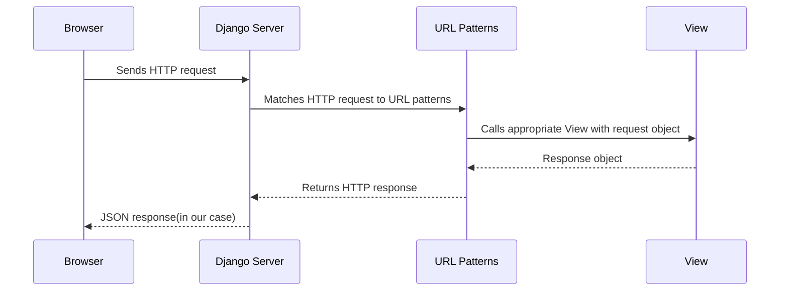

# 🌐 Building Your First API with Django and Django Rest Framework

## Summary

The goal of this tutorial is for you to have Music API ready to receive songs, albums, and artists. While you learn [Django](https://www.djangoproject.com/) and [Django Rest Framework a.k.a DRF](https://www.django-rest-framework.org/) to build you first API

Requirements list:
1. Python 3
2. Git
3. 

- **Total Duration:** 3 hours 30 minutes
- **Lecture:** 1 hour (approximately 30%)
- **Exercises:** 2 hours 30 minutes (approximately 70%)


[Presentation slides](https://docs.google.com/presentation/d/1Ajv9MYQQ011_Y4r1W4I6Y-6XP_faFF0317Zkn2XupMw/edit?usp=sharing) 📊


## Introduction and Overview

### [Django](https://www.djangoproject.com/)
To start, we first need to understand what Django is. Django is the most popular web framework in the Python ecosystem, characterized by its high-level structure that encourages rapid development and clean, pragmatic design. It has been constructed by experienced developers and aims to mitigate the hassles of web development; this allows developers to focus their attention on writing their app without feeling the need to reinvent the wheel. Django is a free and open-source framework that is ingrained in the model-template-views architectural pattern. Its maintenance is overseen by the Django Software Foundation, an independent, non-profit organization based in the United States.

### [Django Rest Framework](https://www.django-rest-framework.org/)
The Django Rest Framework is a powerful library constructed on top of Django, with a unique interlinking to the Django Model. This relationship endows Django with the enhanced ability to create APIs(application programming interfaces).

An important thing to know about Django is how the information usually flows



The sequence diagram illustrates the flow of an HTTP request through the Django web framework. Let's break it down step by step:

1. **Browser Sends HTTP Request:** The process begins when the user interacts with the browser, triggering an HTTP request. This request is sent to the Django server.

2. **Django Server Receives Request:** Upon receiving the request, the Django server forwards it to the URL dispatcher (URL Patterns) to determine which view function should handle it.

3. **URL Patterns Match Request to View:** The URL dispatcher matches the incoming HTTP request to the appropriate view function based on the URL patterns defined in the Django project. It then calls the corresponding view function, passing along the request object.

4. **View Processes Request:** The view function performs the necessary processing based on the request received. This could involve querying the database, performing business logic, or any other required tasks. Once the processing is complete, the view returns a response object.

5. **Response Travels Back:** The response object generated by the view function travels back through the same path it came from, starting with the URL dispatcher. The response is passed back to the Django server.

6. **HTTP Response Returned:** The Django server sends the HTTP response, typically in the form of JSON data in your case, back to the browser, fulfilling the original request.

This sequence outlines the typical flow of a request-response cycle in Django, demonstrating how requests are handled and responses are generated within the framework.

## Set up the project

Now we have a basic understanding of Django and DRF. We are going to set up the project.

Clone the repository:

```shell
git clone git@github.com:lipemorais/building-your-first-api-with-django-and-django-rest-framework.git
```

This will clone the repository

## Creating the music Django App

Now we are going to create the Django we are going to use in this tutorial.

```shell
cd first_api
./manage.py startapp music
```

This will create the app structure for us. Something similar to this below:
```shell
❯ tree .
.
├── db.sqlite3
├── first_api
│   ├── __init__.py
│   ├── __pycache__
│   │   ├── __init__.cpython-312.pyc
│   │   ├── settings.cpython-312.pyc
│   │   ├── urls.cpython-312.pyc
│   │   └── wsgi.cpython-312.pyc
│   ├── asgi.py
│   ├── settings.py
│   ├── urls.py
│   └── wsgi.py
├── manage.py
└── music
    ├── __init__.py
    ├── admin.py
    ├── apps.py
    ├── migrations
    │   └── __init__.py
    ├── models.py
    ├── tests.py
    └── views.py
```

## Django Models

Now the next step is create the models we are going to use in our API to represent the domain models.

We are going to create 3 models in the file models.py

1. Artist
2. Album
3. Song

Let's start with the artist model.

```python
class Artist(models.Model):
    name = models.CharField(max_length=100)

    def __str__(self):
        return self.name
```

Don't forget to import the models
```python
from django.db import models
```
Now the album model
```python
class Album(models.Model):
    title = models.CharField(max_length=100)
    artist = models.ForeignKey(Artist, on_delete=models.CASCADE)
    release_year = models.IntegerField()

    def __str__(self):
        return self.title
```

the last model will be the song model that will have relationship with artist and album.

```python
class Song(models.Model):
    author = models.CharField(max_length=100)
    title = models.CharField(max_length=100)
    artist = models.ForeignKey(Artist, on_delete=models.CASCADE)  # Artist or band name
    album = models.ForeignKey(Album, on_delete=models.CASCADE)  # Album the song belongs to
    duration = models.IntegerField()  # Duration of the song in seconds
```

## URL Mapping and Views

- 🎬 Lecture : Explanation of URL configurations and Views/ViewSets in Django.
- 💻 Exercise : Students implement URL mapping and views for a sample API.
- 💡 Purpose: Practical understanding of Django's routing and controller mechanisms.

## Serializers

- 🎬 Lecture : The role and implementation of serializers.
- 💻 Exercise : Students practice converting data formats using serializers.
- 💡 Purpose: Grasping data format conversions essential in API communication.

## Building an API - Part I

- 💻 Exercise: Students start building a basic API, integrating learned concepts.
- 💡 Purpose: Applying accumulated knowledge in a practical project.

## Lunch/Break

- ⏳ Time for rest and informal discussions.

## Building an API - Part II

- 💻 Exercise: Continuation of the API project with instructor support.
- 💡 Purpose: Completing the API project, reinforcing learning through practice.

## Q&A and Wrap-Up

- 🎬 Lecture: Recap of the day's lessons, addressing questions.
- 💡 Purpose: Ensuring clarity and concluding the session.
